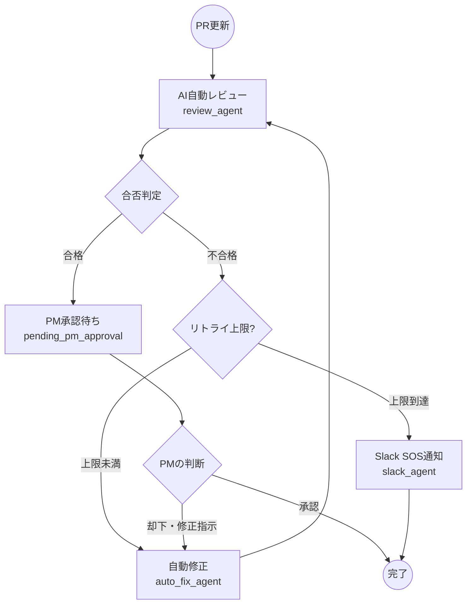

# コードレビューを支援するAIエージェント


AIがPull Requestのコードレビューから自動修正まで自律実行！Google Agent Development Kit (ADK 2.0) と Gemini を活用し、PMの最終承認（Human-in-the-Loop）やSOS通知機能も完備。人間とAIが協調し、安全かつ爆速なDevOpsを実現するエージェントです。

> 本プロジェクトは「DevOps × AI Agent Hackathon」の提出作品です。

## 💡 プロジェクトの背景と課題解決

開発現場における「PRを出したけれどレビュアーが忙しくてマージされない」「些細なLintエラーやタイポで差し戻され、無駄な往復が発生する」というDevOpsのボトルネックを解消します。
単なる「AIレビューツール（指摘するだけ）」ではなく、**「直すところまでAIにやらせる」** 自律型エージェントを目指して開発しました。

## ✨ コア機能（ADK 2.0 ワークフロー）

Google ADK 2.0のGraphベースのワークフローエンジンを活用し、以下のステートマシンを実装しています。



1. **AI自動レビュー (`review_agent`)**
   - PRのコード差分を読み込み、Gemini 2.5 Flashがレビューを実施。`Pydantic`を用いて確実にJSON形式で合否判定を出力します。
2. **自己修正ループ (`auto_fix_agent`)**
   - レビューでNGが出た場合、指摘内容を元にAIが自らコードを修正し、再度レビューノードへ差し戻す自律ループを回します。
3. **PM最終承認（Human-in-the-Loop）**
   - AIの自己レビューを通過したコードはすぐには適用されず、人間のPMによる最終確認（Approve/Reject）を待ちます。
4. **Slack SOSエスカレーション (`slack_agent`)**
   - バグが深くAIが最大リトライ回数（例: 3回）を超えて修正ループに陥った場合、無限ループを強制ストップし、人間のPMへSOS通知を発火します。

## ディレクトリ構造  

```Plaintext
.
├── main.py              # アプリケーション
├── requirements.txt     # 依存ライブラリ（google-adk, fastapi, uvicornなど）
├── Dockerfile           # Cloud Runデプロイ用のコンテナビルド設定
└── .github/
    └── workflows/
        └── deploy.yml   # GitHub ActionsによるCI/CD自動デプロイパイプライン
```

## 🏗️ アーキテクチャと技術スタック（DevOpsコンセプト）

ハッカソンのテーマである「つくる・まわす・とどける」を体現するアーキテクチャを構築しています。

### 1. つくる (AI Agent)
- **言語/フレームワーク:** Python, FastAPI
- **AI・LLM:** Google Agent Development Kit (ADK 2.0), Gemini 2.5 Flash
- **状態管理:** InMemorySessionService (ADK内蔵)

### 2. まわす (CI/CD)
- **バージョン管理:** GitHub
- **CI/CDパイプライン:** GitHub Actions
- **認証:** Workload Identity Federation (WIF) によるキーレスで安全なデプロイライン

### 3. とどける (Deployment)
- **コンテナレジストリ:** Artifact Registry
- **サーバーレス環境:** Google Cloud Run (プッシュするだけで自動デプロイ・オートスケール)

## 🚀 今後のロードマップ (Next Steps)

ハッカソン期間内でコアとなる「自律修正ループ」のバックエンド実装とCI/CDラインの開通を完了しました。今後は以下の拡張を行い、実務に即投入できるプロダクトへ進化させます。

- [ ] **GitHub Actions連携の実装:** 実際のPRイベントをWebhookで受け取り、AIの修正コードをPRに直接自動コミットする機能。
- [ ] **Human-in-the-Loop APIの拡充:** 一時停止したセッションに対し、PMが外部（Web UI等）からApprove/Rejectを注入できるエンドポイントの構築。
- [ ] **Slack Webhook連携:** SOS発火時に、実際のSlackチャンネルへアラートを送信する機能の統合。

## 🧪 Swagger UIでの動作テスト (Try it out)

`POST /review` エンドポイントを開き、**[Try it out]** ボタンをクリックして以下のJSONデータを入力し、**[Execute]** を実行してください。

#### テスト用サンプルデータ（自動修正ループ体験用）
以下のコード差分には「足し算の関数なのに引き算をしている」という意図的なバグが含まれています。

```json
{
  "pr_id": "PR-101",
  "code_diff": "def add_numbers(a, b):\n    return a - b  # 意図的なバグ: 足し算なのに引いている",
  "max_retries": 3
}
